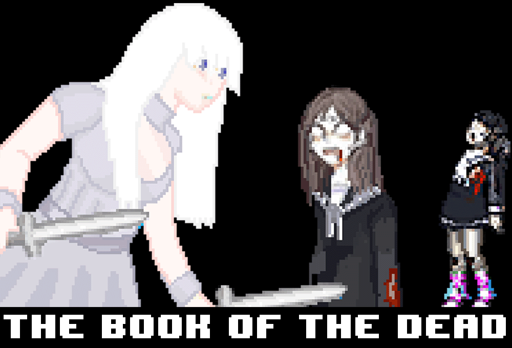

# The Book of The Dead

v.0.0.1-beta

A demo for a side scroller video game written in JavaScript (without canvas).

## Controls

Click enter/return to start/restart the game.  Use the arrow keys to control motion and the up arrow key to enter doors.  Use the spacebar to throw knives.

## Credit

- Intro Music: [http://freemusicarchive.org/music/BoxCat_Games/](http://freemusicarchive.org/music/BoxCat_Games/).
- Level 1 Music: [http://freesound.org/people/RichardCulver/](http://freesound.org/people/RichardCulver/)
- (Misc) Sound Effects: [https://www.freesound.org](https://www.freesound.org)

## License

No license.
