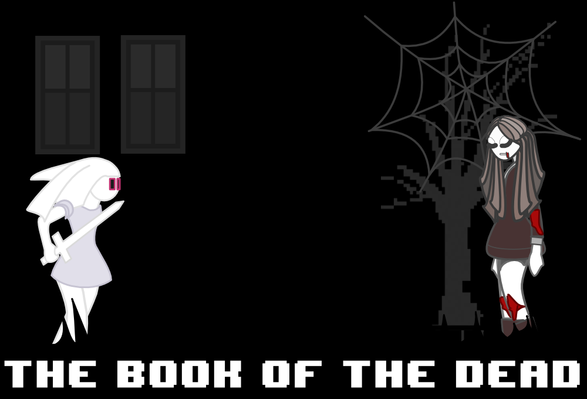

# The Book of the Dead

The Book of the Dead is a demo for a side scroller video game written (mostly)
in vanilla JavaScript using animated html elements.  At present this project
is unavailable on touch screen devices and works best on Chrome and Firefox.

## Controls

Click enter/return to start/restart the game.  Use the arrow keys to control
motion and the up arrow key to enter doors.  Use the spacebar to kill enemies
with a sword.

## Plot

Zombie apocalypse due to demons unleashed by the book of the dead.

## Note

At some point in the future I will transfer this over to react but I'm too
lazy right now to do it.

## Credit

- Intro Music: [http://freemusicarchive.org/music/BoxCat_Games/](http://freemusicarchive.org/music/BoxCat_Games/).
- Level 1 Music: [http://freesound.org/people/RichardCulver/](http://freesound.org/people/RichardCulver/)
- (Misc) Sound Effects: [https://www.freesound.org](https://www.freesound.org)
